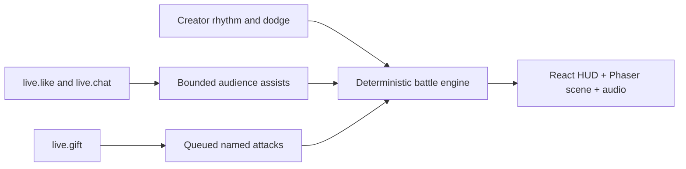

# Candy Arena

**A creator-controlled rhythm duel built with React, Phaser, and a deterministic TypeScript battle engine.** The creator plays the core combat loop; the audience contributes energy, assists, and direct gift skills.

  <a class="tt-demo-button tt-demo-button--brand" href="https://liangpeiran-bit.github.io/candy-arena-duel/?demo=1" target="_blank" rel="noreferrer">Try simulated demo ↗</a>
  <a class="tt-demo-button" href="/samples/javascript">Read the web sample</a>

  
<small>FORMAT</small><strong>Rhythm combat</strong>

  
<small>STACK</small><strong>React + Phaser</strong>

  
<small>INPUT</small><strong>Keyboard + LIVE events</strong>

  
<small>QUALITY</small><strong>Unit + E2E coverage</strong>

## Two inputs, one battle engine

| Input | Game mapping | Boundary |
| --- | --- | --- |
| Creator controls | Direction sequence, beat confirmation, and active dodge | Remains the primary way to win the duel |
| `live.like` | Every 100 likes adds 2 hero energy | 20 energy maximum per round |
| `live.chat` | Five distinct cheers within 15 seconds award one assist | Identity window and per-round storage cap |
| `live.gift` | Bypasses rhythm input and directly queues an existing hero attack | Strict ID matching, combo-delta handling, bounded TTL queue |

## Gifts reuse the combat system

| Gift ID | Gift | Existing move triggered |
| --- | --- | --- |
| `5655` | Rose | Star Jab |
| `6064` | GG | Rainbow Kick |
| `5487` | Finger Heart | Comet Uppercut |
| `5879` | Doughnut | Star Dash |
| `7569` | Game Controller | Comet Uppercut |
| `11046` | Universe | Galaxy Candy Storm |

The integration does not maintain a second gift-only combat model. Gift events enter the same attack queue, animation state machine, hit timing, VFX, and sound path as creator-triggered moves.

## How it was built

1. **Translate the visual target into a playable loop.** React owns HUD and controls; Phaser owns the arena, characters, camera, and effects.
2. **Make combat deterministic.** A fixed-step engine separates damage and timing from rendering, making the duel reproducible and testable.
3. **Add creator skill.** Direction sequences, beat grades, combo, ultimate energy, and active dodge keep the game playable without live events.
4. **Connect Local Data Access.** The client scans the dynamic loopback range, authenticates, normalizes public events, and routes them through a dedicated interaction controller.
5. **Iterate presentation and quality.** Character poses, arena depth, audience animation, gift-specific VFX, audio, responsive layout, texture checks, unit tests, and multi-resolution E2E checks were added incrementally.
6. **Separate public demo from real access.** `?demo=1` skips credentials and emits labeled simulated events; the default URL preserves the real LIVE Studio connection gate.

## Combat presentation

  <figure><figcaption>A Universe event enters the existing ultimate skill path.</figcaption></figure>
  <figure><figcaption>Attack state, camera, character pose, particles, and audio resolve together.</figcaption></figure>

## Engineering takeaways

- React and Phaser communicate through the battle engine instead of mutating each other's state.
- The live controller owns cheer windows, like milestones, gift combo deltas, queues, and broadcast text.
- Broken or unknown events do not interrupt the fight; reconnect behavior is independent of battle time.
- Startup credentials are removed from the DOM after submission and never enter URL or Web Storage.
- Public demo mode is explicit and simulated. It cannot be confused with a successful live-room connection.

Next: [implement the JavaScript client](/samples/javascript) or [browse the gift catalog](/reference/gift-catalog).
