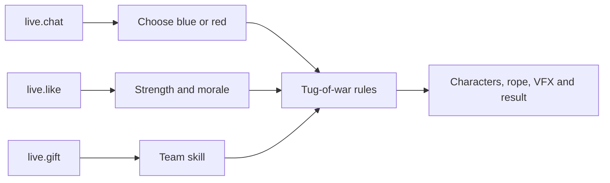

# Tug of Trap

**A room-wide team battle built with Vite, TypeScript, and PixiJS.** Viewers choose blue or red, build pulling power together, and use gifts to protect their team or disrupt the other side.

  <a class="tt-demo-button tt-demo-button--brand" href="https://liangpeiran-bit.github.io/playable_interaction_game/?demo=1" target="_blank" rel="noreferrer">Try simulated demo ↗</a>
  <a class="tt-demo-button" href="/guide/quick-start">Build with the API</a>

  
<small>FORMAT</small><strong>Team competition</strong>

  
<small>STACK</small><strong>PixiJS + TypeScript</strong>

  
<small>PUBLIC EVENTS</small><strong>Like · Gift · Chat</strong>

  
<small>DELIVERY</small><strong>Local WebSocket</strong>

## From event stream to tug-of-war

| Event | Game mapping | Stability rule |
| --- | --- | --- |
| `live.chat` | Select a team; recognized cheers build team actions | Team is locked for the current round; chat commands have cooldowns |
| `live.like` | Strengthens the viewer's unit; each 100-like milestone launches a team wave | Uses cumulative milestones instead of one effect per raw message |
| `live.gift` | Triggers a named tactical skill for the selected team | Matches `gift.id`, handles combo deltas, and queues pre-round gifts |

## Gift design

| Gift ID | Gift | Effect |
| --- | --- | --- |
| `5655` | Rose | +1 team morale |
| `5879` | Doughnut | Shield for 8 seconds; blocks one controller reversal |
| `7569` | Game Controller | Reverses creator controls for 3.5 seconds |
| `17358` | Hamster | Adds six visible helpers for 8 seconds |
| `11046` | Universe | Reduces opposing pull to 70% and reverses controls for 6 seconds |

Gifts received before a viewer chooses a team wait briefly for ownership; unresolved gifts join the smaller real-player team. Effects are capped, cooled down, or converted to morale instead of stacking without limit.

## How it was built

1. **Prove the game loop.** A deterministic tug simulation established team force, rope position, round states, and victory before live data was connected.
2. **Add the protocol boundary.** Port discovery, `SERVER_HELLO` validation, authentication, heartbeat, deduplication, and reconnection were isolated from the PixiJS scene.
3. **Turn events into fair rules.** Team selection, like milestones, cheer windows, gift ownership, combo handling, and cross-round queues were added as testable domain logic.
4. **Raise presentation quality.** The flat prototype evolved into a 3D toy-diorama style with readable blue/red states, character reactions, gift VFX, MVP, streaks, and result choreography.
5. **Create a public path.** `?demo=1` uses clearly labeled simulated interactions; the real mode continues to require LIVE Studio and in-memory credentials.

## Gameplay states

  <figure><figcaption>Coordinated chat creates a timed Rally Sprint.</figcaption></figure>
  <figure><figcaption>The Universe gift changes force, controls, lighting, and status UI together.</figcaption></figure>

## Engineering takeaways

- The browser never assumes a fixed port; it discovers `127.0.0.1:49152-65535` and validates the hello before authenticating.
- Credentials stay in memory. Public demo mode does not ask for or persist them.
- The event adapter produces domain commands. Rendering code never parses raw protocol payloads.
- Bounded queues, cooldowns, deduplication, and round cleanup prevent event bursts from corrupting the match.
- The public deployment contains the playable build; the development repository can remain private.

Next: [inspect the event contracts](/protocol/events) or [apply for access](/apply).
