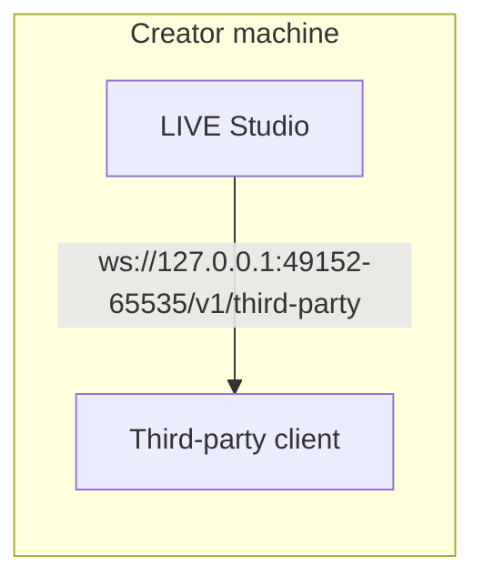
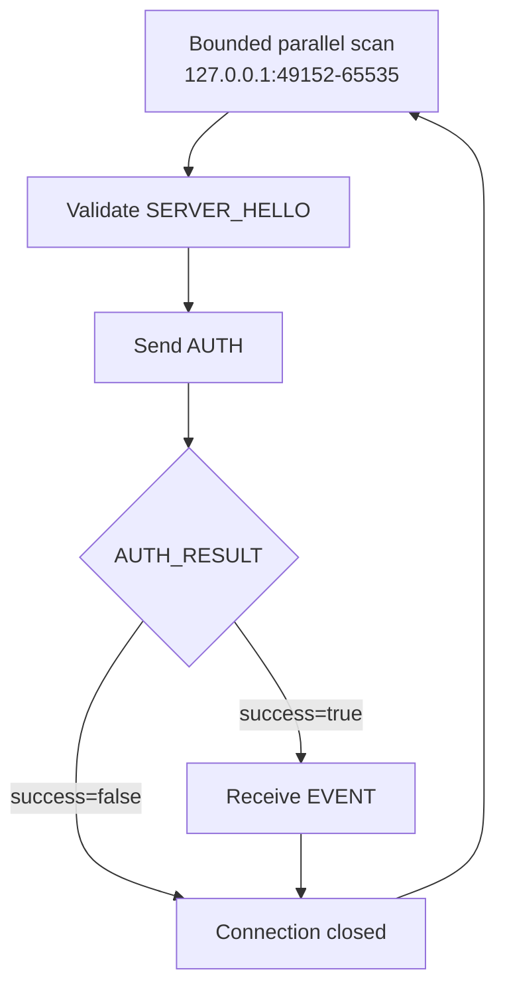

# Architecture

LIVE Studio Local Data Access is a local WebSocket service on the creator machine. A third-party client discovers the endpoint, authenticates with issued credentials, and then receives live room events.

## Deployment model

The service accepts connections on loopback only. Clients must connect to `127.0.0.1`. Remote hosts cannot reach this endpoint.

## Client flow

After a disconnect, authentication state is gone. A new connection must repeat discovery, `SERVER_HELLO` validation, and `AUTH`.

## Endpoint

| Field | Value |
| --- | --- |
| Host | `127.0.0.1` |
| Port range | `49152` to `65535` |
| Path | `/v1/third-party` |
| Protocol version | `1.0.0` |

LIVE Studio probes from `49152` upward and binds the first available port. The actual port may change after restart. Scan candidate URLs in bounded parallel batches until one returns a valid `SERVER_HELLO`; do not hard-code a port or open the entire range at once.

## Access rules

A client can receive events only when all of the following are true:

- Local data access is enabled for the current LIVE Studio environment.
- The issued `app_id`, `key_id`, and `secret` are valid.
- The event is enabled for that application.
- The connection is within the allowed total and per-app limits.

If access is later disabled, credentials are revoked, or limits change, the server may send `DISCONNECT` with `reason_code=510` and close the socket.

## Protocol messages

| Message | Direction | When it appears |
| --- | --- | --- |
| `SERVER_HELLO` | Server to client | Immediately after the WebSocket opens |
| `AUTH` | Client to server | First client JSON message |
| `AUTH_RESULT` | Server to client | After authentication succeeds or fails |
| `EVENT` | Server to client | After authentication succeeds |
| `DISCONNECT` | Server to client | Before an intentional close, when applicable |

See [Connection Lifecycle](/protocol/connection) and [Authentication](/protocol/auth) for field-level details.
