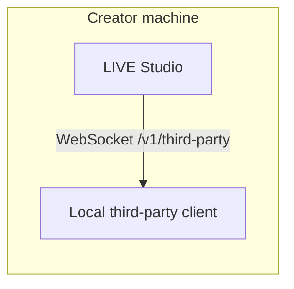

# Overview

LIVE Studio Local Data Access exposes selected live room events from the creator machine to trusted local third-party clients.

LIVE Studio provides a local WebSocket endpoint on the creator machine. A third-party client connects to that endpoint, authenticates with an issued credential, and then receives real-time event messages.

## What it enables

- Local H5 tools can react to likes, gifts, and chat messages.
- Unity or native game clients can consume live room events without embedding into LIVE Studio.
- Developer tools can listen to a stable JSON protocol for debugging or automation.

## What it does not enable

- It does not push personalized state to viewer devices.
- It does not make the livestream video per-viewer.
- It does not expose a remote cloud API.
- It does not bypass application allowlist or event allowlist policy.

## Current public events

| Event | Description |
| --- | --- |
| `live.like` | Live room like message |
| `live.gift` | Live room gift message |
| `live.chat` | Live room text chat message |

## Integration model

The endpoint is local-only. Clients must connect to `127.0.0.1` and complete authentication before receiving events.
