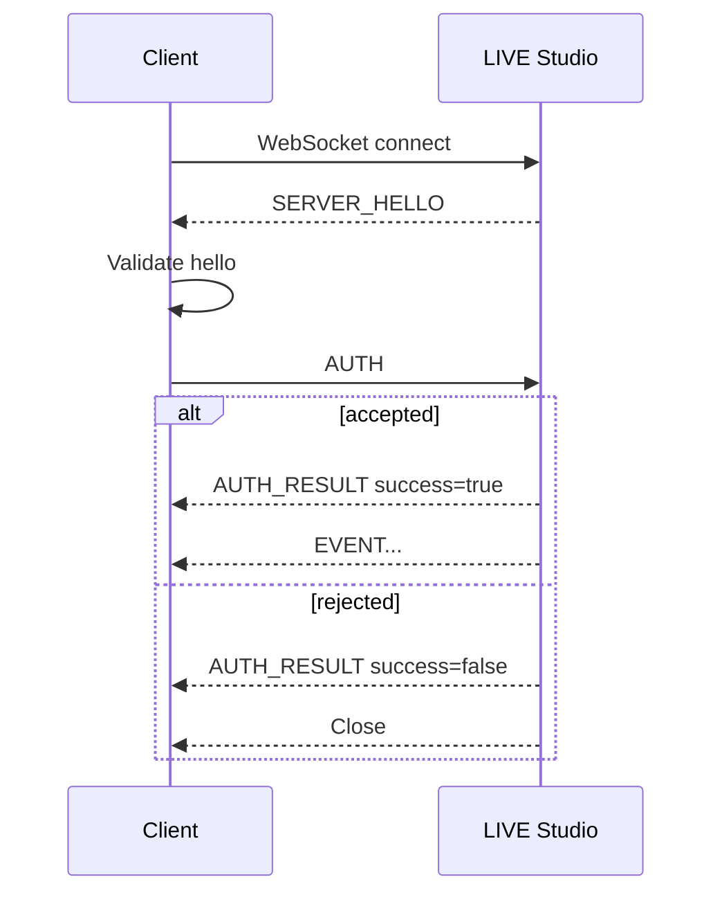

# Authentication

Authentication is required before a third-party client can receive events.

## Message order



The client must send `AUTH` as the first JSON message after validating `SERVER_HELLO`.

## `SERVER_HELLO`

Direction: server to client.

Sent immediately after WebSocket connection.

| Field | Type | Required | Description |
| --- | --- | --- | --- |
| `type` | string | Yes | Always `SERVER_HELLO` |
| `product` | string | Yes | Always `tiktok_live_studio` |
| `channel` | string | Yes | Always `third-party-im` |
| `version` | string | Yes | Server protocol version |

```json
{
  "type": "SERVER_HELLO",
  "product": "tiktok_live_studio",
  "channel": "third-party-im",
  "version": "1.0.0"
}
```

## `AUTH`

Direction: client to server.

Must be the first client JSON message.

| Field | Type | Required | Description |
| --- | --- | --- | --- |
| `type` | string | Yes | Always `AUTH` |
| `app_id` | string | Yes | Issued application identifier |
| `key_id` | string | Yes | Issued key version identifier |
| `secret` | string | Yes | Raw application secret |
| `version` | string | No | Client protocol version |

```json
{
  "type": "AUTH",
  "app_id": "your_app_id",
  "key_id": "your_key_id",
  "secret": "your_secret",
  "version": "1.0.0"
}
```

::: warning
Send the raw `secret`. Do not hash or transform it on the client side.
:::

## `AUTH_RESULT`

Direction: server to client.

Sent after authentication succeeds or fails.

| Field | Type | Required | Description |
| --- | --- | --- | --- |
| `type` | string | Yes | Always `AUTH_RESULT` |
| `success` | boolean | Yes | Whether authentication succeeded |
| `app_id` | string | Yes | Application identifier parsed from the request |
| `app_name` | string | No | Application display name when available |
| `message` | string | Yes | Human-readable result |
| `server_time` | number | Yes | Unix timestamp in milliseconds |
| `version` | string | Yes | Server protocol version |
| `error_code` | string | No | Present when authentication fails |

Success:

```json
{
  "type": "AUTH_RESULT",
  "success": true,
  "app_id": "your_app_id",
  "app_name": "Example App",
  "message": "Authentication successful",
  "server_time": 1786010400000,
  "version": "1.0.0"
}
```

Failure:

```json
{
  "type": "AUTH_RESULT",
  "success": false,
  "app_id": "your_app_id",
  "message": "Invalid credentials",
  "server_time": 1786010400000,
  "version": "1.0.0",
  "error_code": "INVALID_CREDENTIALS"
}
```

## Policy checks

Authentication succeeds only when all checks pass:

- Local data access is enabled.
- `app_id` exists in the allowlist.
- `key_id` matches the configured key.
- `secret` matches the issued credential.
- Total connection count is below the policy limit.
- Per-app connection count is below the policy limit.

