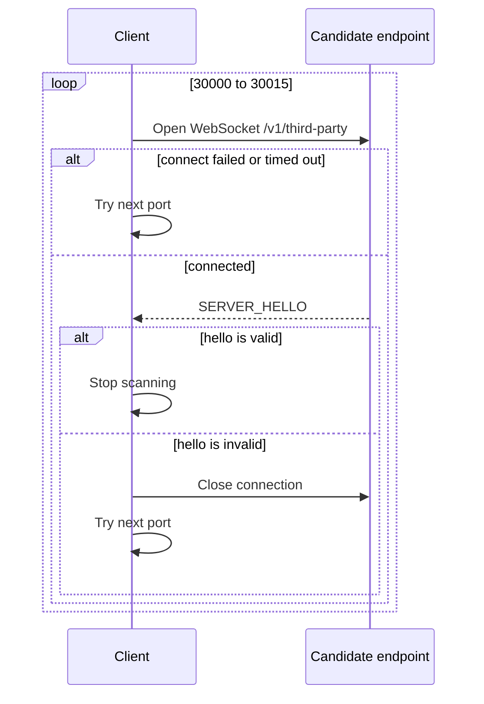
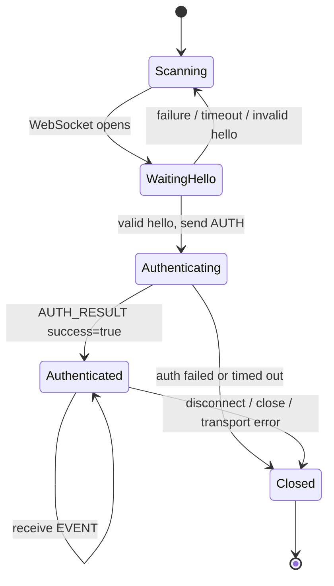

# Connection Lifecycle

Third-party clients connect to LIVE Studio through a local WebSocket endpoint.

## Endpoint

| Field | Value |
| --- | --- |
| Host | `127.0.0.1` |
| Port range | `30000` to `30015` |
| Path | `/v1/third-party` |
| Protocol version | `1.0.0` |

Full URL:

```txt
ws://127.0.0.1:{port}/v1/third-party
```

## Discovery flow



Clients should validate `SERVER_HELLO` before sending credentials. A port that does not return a valid hello must be treated as unrelated.

## State machine



## Timeouts and heartbeat

| Setting | Value |
| --- | --- |
| Authentication timeout | 20 seconds |
| WebSocket ping interval | 30 seconds |

The protocol uses native WebSocket ping/pong. It does not define a JSON `HEARTBEAT` message.

## Reconnection

When a connection closes, its authentication state is gone. A new WebSocket must repeat:

1. Port discovery
2. `SERVER_HELLO` validation
3. `AUTH`
4. `AUTH_RESULT` handling

Use reconnect backoff to avoid hitting connection limits during policy or network failures.

