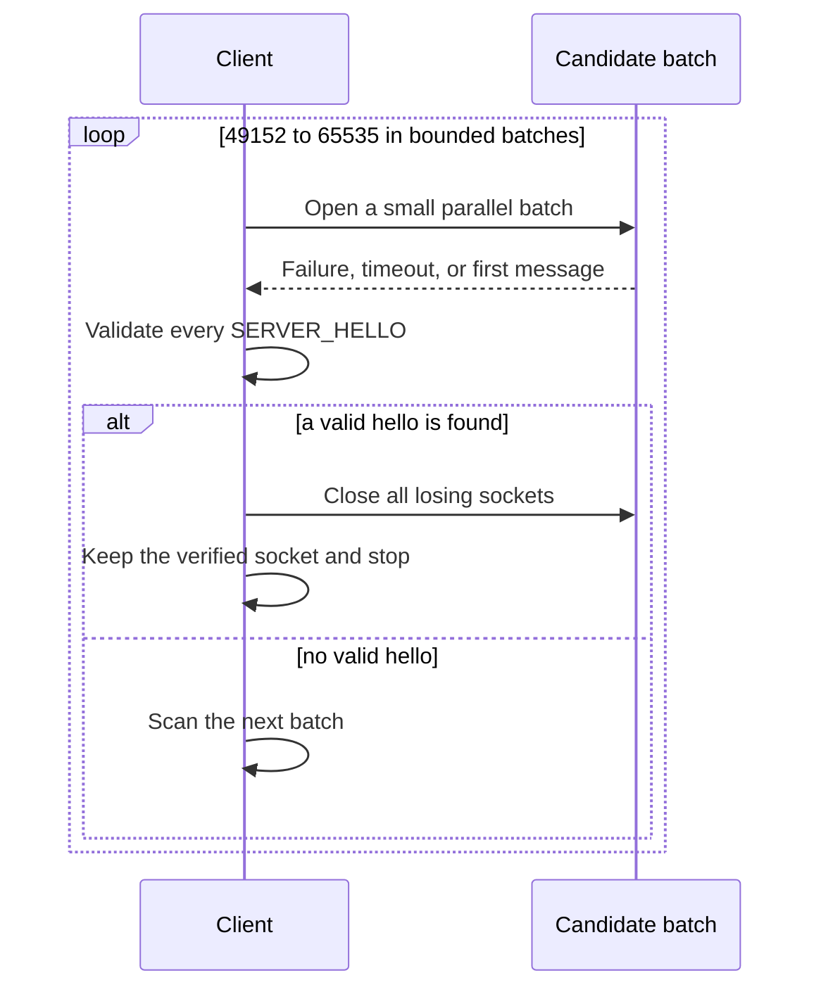
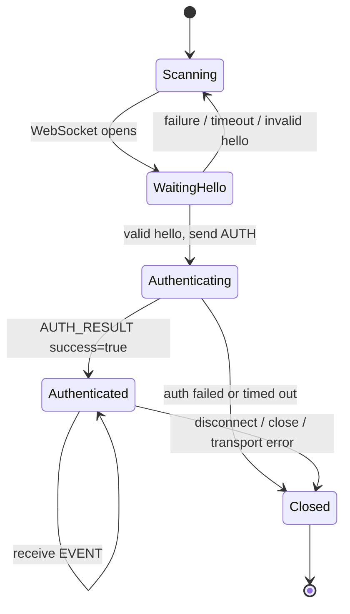

# Connection Lifecycle

Third-party clients connect to LIVE Studio through a local WebSocket endpoint.

## Endpoint

| Field | Value |
| --- | --- |
| Host | `127.0.0.1` |
| Port range | `49152` to `65535` |
| Path | `/v1/third-party` |
| Protocol version | `1.0.0` |

Full URL:

```txt
ws://127.0.0.1:{port}/v1/third-party
```

## Discovery flow



LIVE Studio probes this range from low to high and binds the first available port. The selected port can change after restart, so clients must discover it rather than hard-code or permanently cache it.

The range contains 16,384 candidates. Scan in small, bounded parallel batches, close losing sockets, and validate `SERVER_HELLO` before sending credentials. A port that does not return a valid hello must be treated as unrelated. Never open the entire range at once.

## State machine



## Timeouts and heartbeat

| Setting | Value |
| --- | --- |
| Authentication timeout | 20 seconds |
| WebSocket ping interval | 30 seconds |

The protocol uses native WebSocket ping/pong. It does not define a JSON `HEARTBEAT` message.

## Reconnection

When a connection closes, its authentication state is gone. A new WebSocket must repeat:

1. Port discovery
2. `SERVER_HELLO` validation
3. `AUTH`
4. `AUTH_RESULT` handling

Use reconnect backoff to avoid hitting connection limits during policy or network failures.

