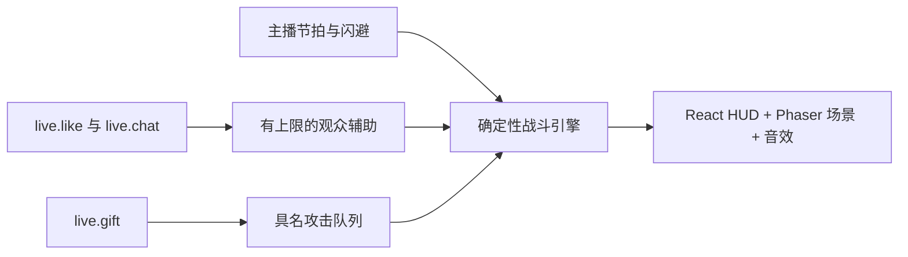

# 糖果擂台

**一款由主播操作的节奏对战游戏，使用 React、Phaser 和确定性的 TypeScript 战斗引擎构建。** 主播完成核心战斗，观众则通过能量、辅助和礼物技能直接加入对局。

  <a class="tt-demo-button tt-demo-button--brand" href="https://liangpeiran-bit.github.io/candy-arena-duel/?demo=1" target="_blank" rel="noreferrer">试玩模拟互动 ↗</a>
  <a class="tt-demo-button" href="/zh/samples/javascript">查看 Web 示例</a>

  
<small>玩法形态</small><strong>节奏战斗</strong>

  
<small>技术栈</small><strong>React + Phaser</strong>

  
<small>操作输入</small><strong>键盘 + 直播事件</strong>

  
<small>质量保障</small><strong>单测 + E2E</strong>

## 两种输入，一个战斗引擎

| 输入 | 游戏映射 | 边界 |
| --- | --- | --- |
| 主播操作 | 方向序列、节拍确认与主动闪避 | 仍是赢得对局的主要方式 |
| `live.like` | 每 100 赞增加 2 点英雄能量 | 每局最多 20 点 |
| `live.chat` | 15 秒内 5 名不同观众助威，获得一张辅助券 | 身份窗口与单局存储上限 |
| `live.gift` | 跳过节拍输入，直接排队释放英雄已有攻击 | 严格按 ID 匹配、处理连送差值、有界 TTL 队列 |

## 礼物复用已有战斗系统

| 礼物 ID | 礼物 | 触发的既有招式 |
| --- | --- | --- |
| `5655` | 玫瑰 | 星糖快拳 |
| `6064` | GG | 彩虹回旋踢 |
| `5487` | 手指爱心 | 彗星上勾拳 |
| `5879` | 甜甜圈 | 星糖冲刺 |
| `7569` | 游戏手柄 | 彗星上勾拳 |
| `11046` | 宇宙 | 银河糖果风暴 |

接入层没有维护第二套“礼物专用战斗模型”。礼物事件和主播操作使用同一条攻击队列、动画状态机、命中时机、特效与声音链路。

## 编辑与构建过程

1. **把视觉目标转成可玩循环。** React 负责 HUD 与操作，Phaser 负责竞技场、角色、镜头和特效。
2. **让战斗结果可复现。** 固定时间步引擎把伤害与时序从渲染层分离，便于验证和测试。
3. **建立主播操作深度。** 方向序列、节拍判定、Combo、大招能量和主动闪避，让没有直播事件时游戏仍然成立。
4. **接入本地数据开放。** 客户端扫描动态回环端口、完成鉴权、标准化公开事件，再交给独立的互动控制器。
5. **逐步提高演出与质量。** 持续补齐角色姿态、场景纵深、观众动画、礼物专属特效、音效、响应式布局、贴图检查、单元测试和多分辨率 E2E。
6. **分离公开试玩与真实接入。** `?demo=1` 跳过凭证并明确产生模拟事件；默认地址仍保留真实 LIVE Studio 连接门槛。

## 战斗演出

  <figure><figcaption>宇宙事件进入已有大招链路。</figcaption></figure>
  <figure><figcaption>攻击状态、镜头、角色姿态、粒子与声音同时结算。</figcaption></figure>

## 工程经验

- React 与 Phaser 通过战斗引擎通信，而不是互相修改状态。
- 直播互动控制器负责助威窗口、点赞里程碑、礼物连送差值、队列与播报。
- 损坏或未知事件不会中断战斗，重连行为也不影响战斗时钟。
- 启动凭证提交后会离开 DOM，不写入 URL 或 Web Storage。
- 公开试玩明确标注并只使用模拟事件，不会与真实直播间连接成功混淆。

下一步：[实现 JavaScript 客户端](/zh/samples/javascript)或[浏览礼物目录](/zh/reference/gift-catalog)。
