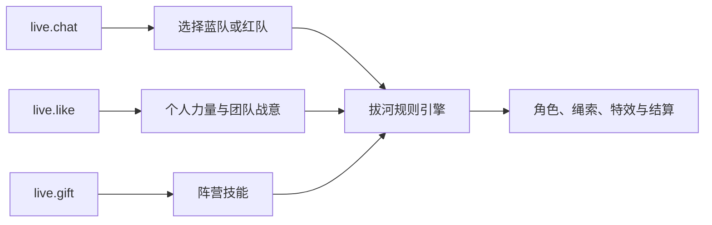

# 拔河陷阱

**一款由整场直播共同参与的阵营对抗游戏，使用 Vite、TypeScript 与 PixiJS 构建。** 观众选择蓝队或红队，一起积累拉力，并通过礼物保护己方或干扰对手。

  <a class="tt-demo-button tt-demo-button--brand" href="https://liangpeiran-bit.github.io/playable_interaction_game/?demo=1" target="_blank" rel="noreferrer">试玩模拟互动 ↗</a>
  <a class="tt-demo-button" href="/zh/guide/quick-start">开始接入</a>

  
<small>玩法形态</small><strong>多人阵营对抗</strong>

  
<small>技术栈</small><strong>PixiJS + TypeScript</strong>

  
<small>公开事件</small><strong>点赞 · 礼物 · 评论</strong>

  
<small>数据链路</small><strong>本机 WebSocket</strong>

## 从直播事件到拔河

| 事件 | 游戏映射 | 稳定性规则 |
| --- | --- | --- |
| `live.chat` | 选择阵营；识别号子并推进团队事件 | 单局锁队；评论指令带个人冷却 |
| `live.like` | 强化观众小兵；每累计 100 赞形成团队点赞浪潮 | 使用累计里程碑，不按原始消息逐条触发 |
| `live.gift` | 为已选阵营发动具名战术技能 | 按 `gift.id` 匹配，处理连送差值，并为未开局礼物排队 |

## 礼物如何影响比赛

| 礼物 ID | 礼物 | 效果 |
| --- | --- | --- |
| `5655` | 玫瑰 | 团队战意 +1 |
| `5879` | 甜甜圈 | 8 秒护盾，可抵挡一次手柄反转 |
| `7569` | 游戏手柄 | 反转主播操作 3.5 秒 |
| `17358` | 仓鼠加油 | 6 名可见援军加入 8 秒 |
| `11046` | 宇宙 | 对方拉力降至 70%，并反转操作 6 秒 |

观众未选队时送出的礼物会短暂等待认领，超时后进入真人较少的一队。同类效果通过上限、冷却或转化战意处理，不会无限叠加破坏对局。

## 编辑与构建过程

1. **先验证游戏循环。** 在接入直播数据前，用确定性的拔河模拟建立队伍拉力、绳索位置、回合状态和胜负条件。
2. **隔离协议边界。** 端口发现、`SERVER_HELLO` 校验、鉴权、心跳、去重与重连都放在 PixiJS 场景之外。
3. **把事件变成公平规则。** 选队、点赞里程碑、号子窗口、礼物认领、连送处理和跨局队列均成为可测试的领域逻辑。
4. **提高演出完成度。** 从平面原型迭代为 3D 玩具沙盘，补齐蓝红状态、角色反应、礼物特效、MVP、连胜和结算动画。
5. **提供公开试玩。** `?demo=1` 明确使用模拟互动；正式模式仍要求 LIVE Studio 与仅保存在内存中的凭证。

## 关键玩法状态

  <figure><figcaption>多人评论协作触发限时接力冲刺。</figcaption></figure>
  <figure><figcaption>宇宙礼物同时改变拉力、操作、光照与状态提示。</figcaption></figure>

## 工程经验

- 浏览器不假设固定端口，而是发现 `127.0.0.1:49152-65535`，校验 hello 后再鉴权。
- 凭证只保存在内存中；公开试玩不要求输入或持久化凭证。
- 事件适配器输出游戏领域命令，渲染层不直接解析协议载荷。
- 有界队列、冷却、去重和回合清理，避免高频事件破坏比赛状态。
- 线上只部署可试玩构建产物，开发源码可以继续保持私有。

下一步：[查看事件协议](/zh/protocol/events)或[申请接入](/zh/apply)。
