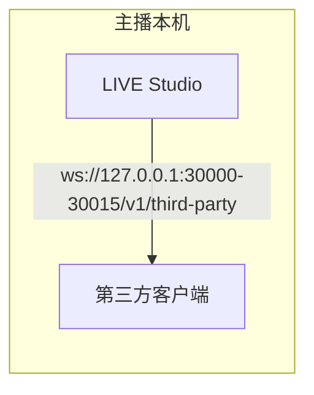
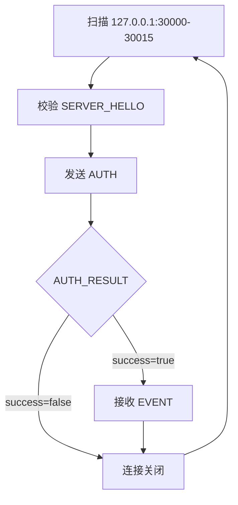

# 架构

LIVE Studio 本地数据开放是主播本机上的 WebSocket 服务。第三方客户端发现端点、用发放的凭证鉴权，随后接收直播间事件。

## 部署模型

服务只接受回环连接。客户端必须连接 `127.0.0.1`。远程主机无法访问该端点。

## 客户端流程

连接断开后，鉴权状态随之失效。新连接必须重新完成服务发现、`SERVER_HELLO` 校验和 `AUTH`。

## 端点

| 字段 | 值 |
| --- | --- |
| Host | `127.0.0.1` |
| 端口范围 | `30000` 到 `30015` |
| Path | `/v1/third-party` |
| 协议版本 | `1.0.0` |

LIVE Studio 会在该范围内绑定一个端口。依次尝试候选 URL，直到收到合法的 `SERVER_HELLO`。

## 接入规则

客户端只有在以下条件全部满足时才能接收事件：

- 当前 LIVE Studio 环境已开启本地数据开放。
- 发放的 `app_id`、`key_id` 和 `secret` 有效。
- 该应用已开通对应事件。
- 连接数未超过总上限和单应用上限。

如果之后接入被关闭、凭证被撤销或限额发生变化，服务端可能发送 `reason_code=510` 的 `DISCONNECT`，然后关闭 socket。

## 协议消息

| 消息 | 方向 | 出现时机 |
| --- | --- | --- |
| `SERVER_HELLO` | 服务端到客户端 | WebSocket 打开后立即发送 |
| `AUTH` | 客户端到服务端 | 客户端第一条 JSON 消息 |
| `AUTH_RESULT` | 服务端到客户端 | 鉴权成功或失败后 |
| `EVENT` | 服务端到客户端 | 鉴权成功之后 |
| `DISCONNECT` | 服务端到客户端 | 主动关闭前（如适用） |

字段细节见 [连接生命周期](/zh/protocol/connection) 和 [鉴权](/zh/protocol/auth)。
