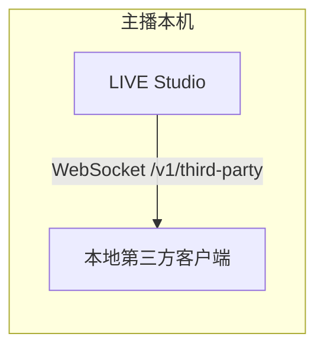

# 概览

LIVE Studio 本地数据开放把主播机上选定的直播间事件，开放给受信任的本地第三方客户端。

LIVE Studio 在主播本机提供 WebSocket 端点。第三方客户端连接该端点，使用发放的凭证鉴权，随后接收实时事件。

## 能做什么

- 本地 H5 工具可以根据点赞、礼物和评论做响应。
- Unity 或原生游戏客户端可以消费直播间事件，而不必嵌入 LIVE Studio。
- 开发者工具可以通过稳定的 JSON 协议做调试或自动化。

## 不能做什么

- 不会把个性化状态推到观众设备。
- 不能让直播流按人分画面。
- 不提供远程云端 API。
- 不能绕过应用白名单或事件白名单策略。

## 当前公开事件

| 事件 | 说明 |
| --- | --- |
| `live.like` | 直播间点赞消息 |
| `live.gift` | 直播间礼物消息 |
| `live.chat` | 直播间文本评论消息 |

## 接入模型

端点只在本机开放。客户端必须连接 `127.0.0.1`，并完成鉴权后才能接收事件。
