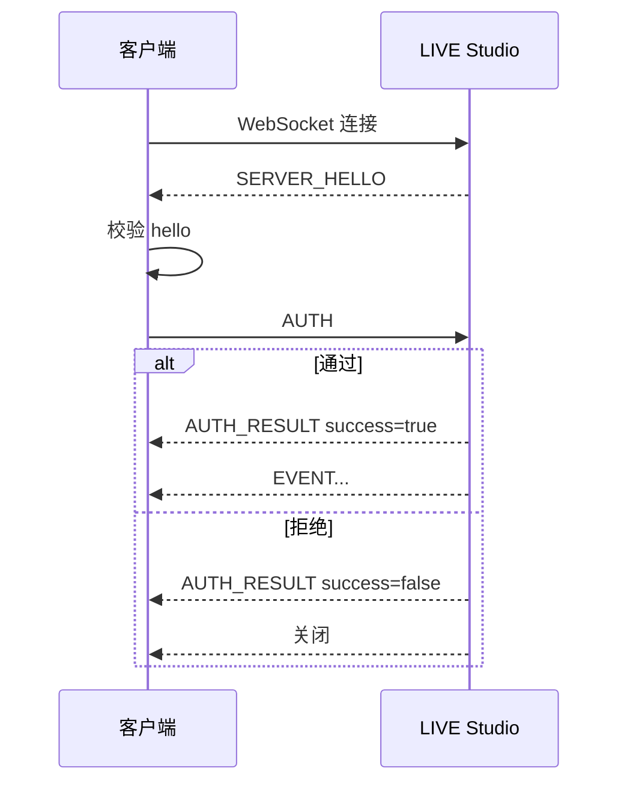

# 鉴权

第三方客户端必须先完成鉴权，才能接收事件。

## 消息顺序



校验 `SERVER_HELLO` 后，客户端发送的第一条 JSON 消息必须是 `AUTH`。

## `SERVER_HELLO`

方向：服务端到客户端。

WebSocket 连接建立后立即发送。

| 字段 | 类型 | 必填 | 说明 |
| --- | --- | --- | --- |
| `type` | string | 是 | 固定为 `SERVER_HELLO` |
| `product` | string | 是 | 固定为 `tiktok_live_studio` |
| `channel` | string | 是 | 固定为 `third-party-im` |
| `version` | string | 是 | 服务端协议版本 |

```json
{
  "type": "SERVER_HELLO",
  "product": "tiktok_live_studio",
  "channel": "third-party-im",
  "version": "1.0.0"
}
```

## `AUTH`

方向：客户端到服务端。

必须是客户端发出的第一条 JSON 消息。

| 字段 | 类型 | 必填 | 说明 |
| --- | --- | --- | --- |
| `type` | string | 是 | 固定为 `AUTH` |
| `app_id` | string | 是 | 发放的应用标识 |
| `key_id` | string | 是 | 发放的密钥版本标识 |
| `secret` | string | 是 | 原始应用 secret |
| `version` | string | 否 | 客户端协议版本 |

```json
{
  "type": "AUTH",
  "app_id": "your_app_id",
  "key_id": "your_key_id",
  "secret": "your_secret",
  "version": "1.0.0"
}
```

::: warning
发送原始 `secret`。不要在客户端侧做哈希或变换。
:::

## `AUTH_RESULT`

方向：服务端到客户端。

鉴权成功或失败后发送。

| 字段 | 类型 | 必填 | 说明 |
| --- | --- | --- | --- |
| `type` | string | 是 | 固定为 `AUTH_RESULT` |
| `success` | boolean | 是 | 鉴权是否成功 |
| `app_id` | string | 是 | 从请求解析出的应用标识 |
| `app_name` | string | 否 | 应用展示名称（如有） |
| `message` | string | 是 | 可读结果说明 |
| `server_time` | number | 是 | Unix 时间戳，毫秒 |
| `version` | string | 是 | 服务端协议版本 |
| `error_code` | string | 否 | 鉴权失败时出现 |

成功：

```json
{
  "type": "AUTH_RESULT",
  "success": true,
  "app_id": "your_app_id",
  "app_name": "Example App",
  "message": "Authentication successful",
  "server_time": 1786010400000,
  "version": "1.0.0"
}
```

失败：

```json
{
  "type": "AUTH_RESULT",
  "success": false,
  "app_id": "your_app_id",
  "message": "Invalid credentials",
  "server_time": 1786010400000,
  "version": "1.0.0",
  "error_code": "INVALID_CREDENTIALS"
}
```

## 策略检查

鉴权只有在以下检查全部通过时才会成功：

- 本地数据开放已开启。
- `app_id` 存在于白名单中。
- `key_id` 与配置的密钥匹配。
- `secret` 与发放的凭证匹配。
- 总连接数低于策略上限。
- 单应用连接数低于策略上限。
