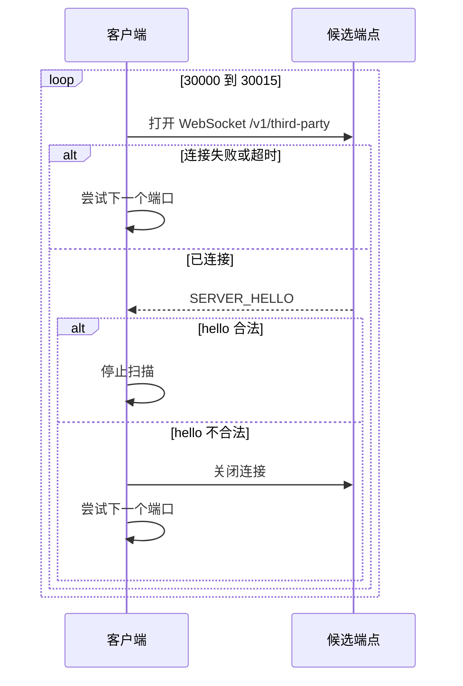
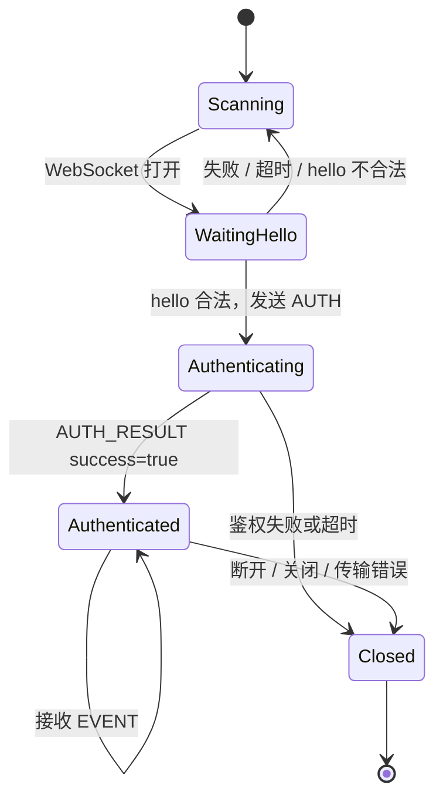

# 连接生命周期

第三方客户端通过本机 WebSocket 端点连接 LIVE Studio。

## 端点

| 字段 | 值 |
| --- | --- |
| Host | `127.0.0.1` |
| 端口范围 | `30000` 到 `30015` |
| Path | `/v1/third-party` |
| 协议版本 | `1.0.0` |

完整 URL：

```txt
ws://127.0.0.1:{port}/v1/third-party
```

## 服务发现流程



发送凭证前必须先校验 `SERVER_HELLO`。没有返回合法 hello 的端口应视为无关服务。

## 状态机



## 超时与心跳

| 配置 | 值 |
| --- | --- |
| 鉴权超时 | 20 秒 |
| WebSocket ping 间隔 | 30 秒 |

协议使用原生 WebSocket ping/pong，不定义 JSON `HEARTBEAT` 消息。

## 重连

连接关闭后，鉴权状态随之失效。新的 WebSocket 必须重新完成：

1. 端口发现
2. `SERVER_HELLO` 校验
3. `AUTH`
4. `AUTH_RESULT` 处理

请使用重连退避，避免在策略或网络故障期间打满连接上限。
